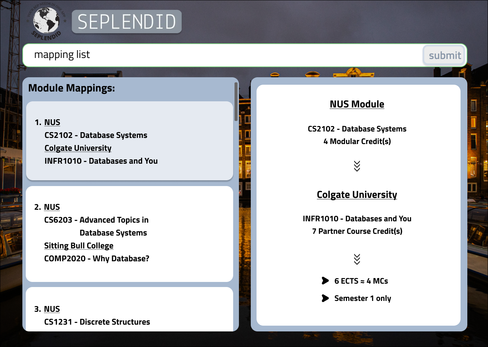

# Introduction
SEPlendid is your passport to a seamless and enriched Student Exchange Programme (SEP) planning experience.

## Example usages:
1. listing local/partner university courses
2. sorting courses by various attributes
3. searching for courses using keywords
4. taking notes for courses/universities

# Additional Notes
* For the detailed documentation of this project, see the **[SEPlendid Product Website](https://ay2324s1-cs2103t-w10-2.github.io/tp/)**.
* This project is based on the AddressBook-Level3 project created by the [SE-EDU initiative](https://se-education.org).