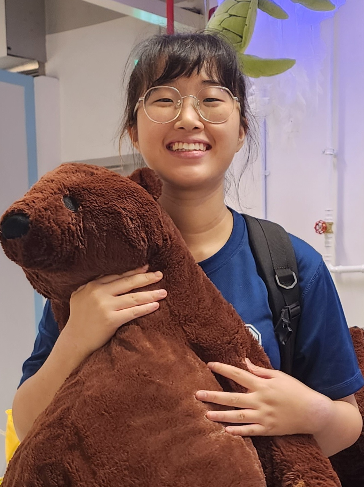
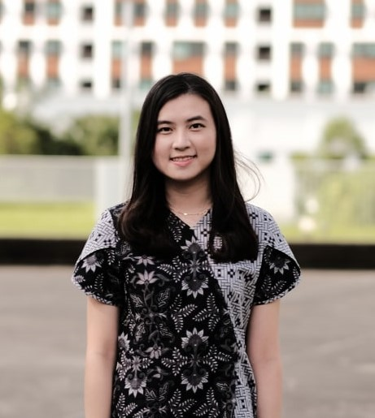

# About Us

We are a team based in the [School of Computing, National University of Singapore](http://www.comp.nus.edu.sg).

You can reach us at the email `seer[at]comp.nus.edu.sg`

## Project team

### Lam Cheng Hou

[[homepage](http://www.comp.nus.edu.sg/~damithch)]
[[github](https://github.com/lamchenghou)]
[[portfolio](https://team/lamchenghou.md)]

* Role: Team Lead
* Responsibilities: Deliverables and Deadlines, Parsing

### Yim Sohyun

[[github](http://github.com/dlathyun)]
[[portfolio](team/johndoe.md)]

* Role: Developer
* Responsibilities: UI

### Alyssa Ong 

[[github](http://github.com/alyssaongyx)] [[portfolio](team/alyssaong.md)]

* Role: Developer
* Responsibilities: UI, Code Quality

### Alicia Michelle Wang

[[github](http://github.com/aliciamichellew)]
[[portfolio](team/aliciamichellew.md)]

* Role: Developer
* Responsibilities: Command + Errors

### Tan Jing Sheng

[[github](http://github.com/tjingsheng)]
[[portfolio](team/tjingsheng.md)]

* Role: Developer
* Responsibilities: Storage, Ui, Testing