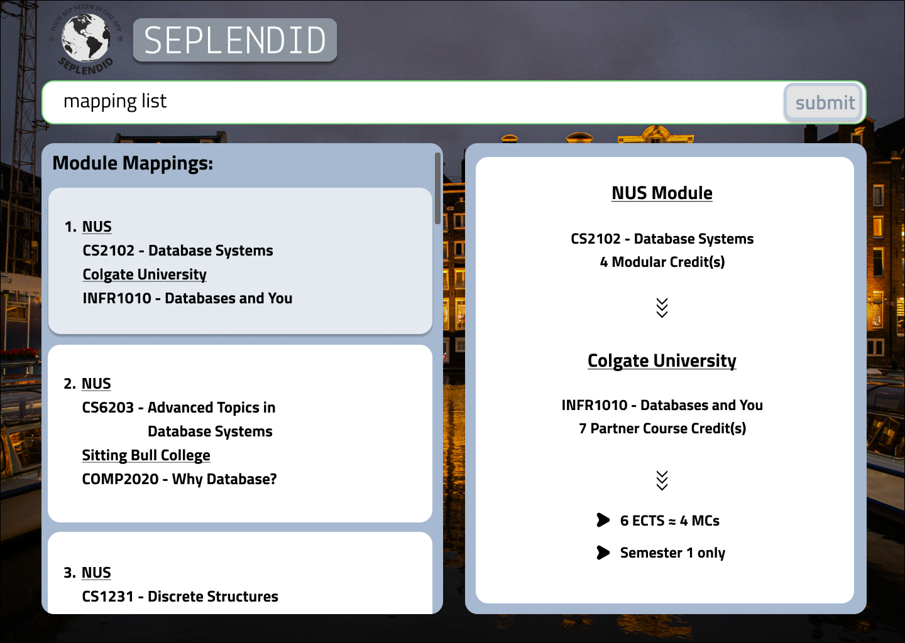
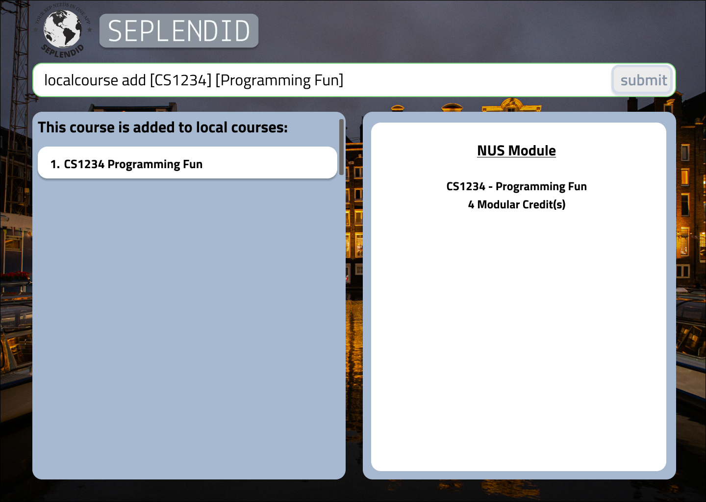
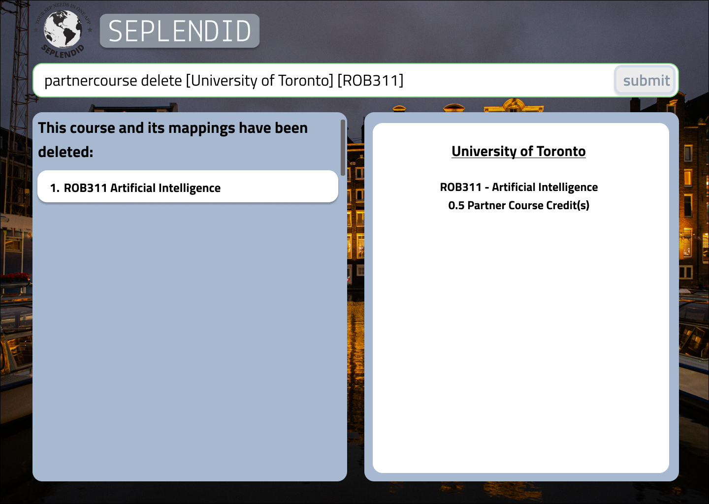
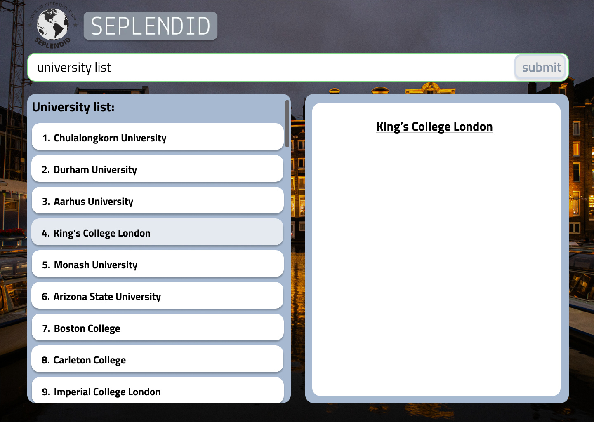
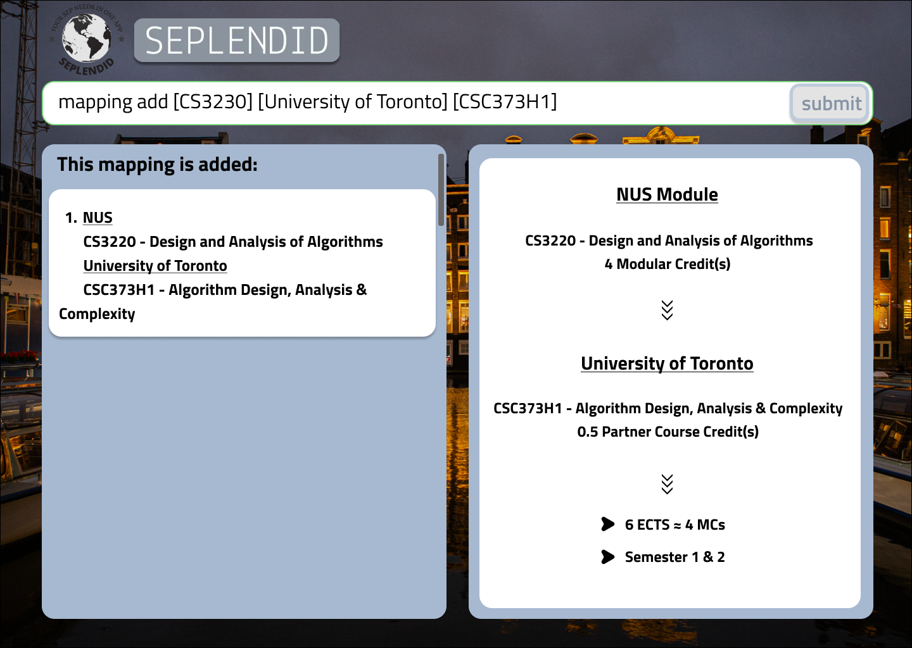
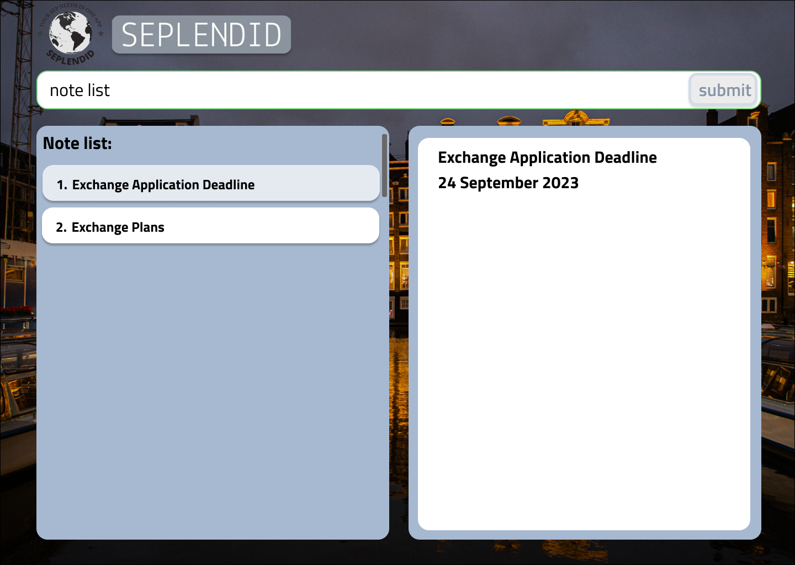
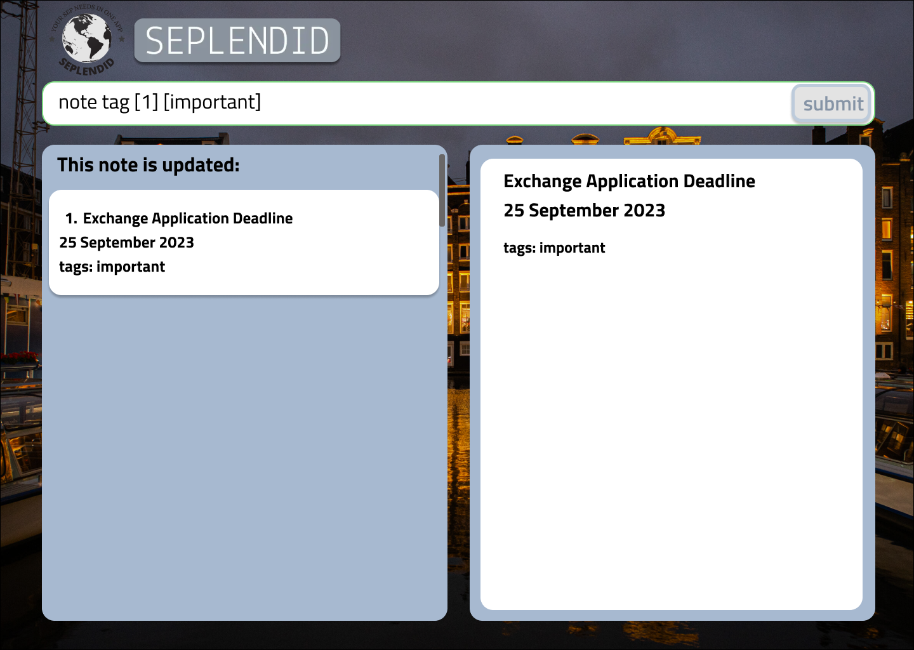

<bottom-head>
    <link rel="stylesheet" href="stylesheets/userguide.css">
</bottom-head>

# SEPlendid User Guide

SEPlendid is a **desktop app for managing contacts, optimized for use via a Line Interface** (CLI) while still
having the benefits of a Graphical User Interface (GUI). If you can type fast and enjoy a wide variety of data
management and query features, SEPlendid can be your quick and versatile tool in SEP planning.

<!-- * Table of Contents -->
<page-nav-print />

--------------------------------------------------------------------------------------------------------------------

## Quick start

1. Ensure you have Java `11` or above installed in your Computer.

1. Download the latest `seplendid.jar` from [here](https://github.com/AY2324S1-CS2103T-W10-2/tp/releases).

1. Copy the file to the folder you want to use as the _home folder_ for SEPlendid.

1. Open a command terminal, `cd` into the folder you put the jar file in, and use the `java -jar seplendid.jar`
   command to run the application. 
   A GUI similar to the below should appear in a few seconds. Note how the app contains some sample data. 
   

1. Type the command in the command box and press Enter to execute it. e.g. typing **`help`** and pressing Enter will
   open the help window. 
   Some example commands you can try:

    * `university list` : Lists all of NUS' partner universities.
   
    * `mapping search [localcode] [CS2103]`: Searches and displays all NUS-to-partner university course mappings 
    based on 
    local 
    NUS course code `CS2103`.

    * `exit` : Exits the app.

1. Refer to the [Features](#features) below for details of each command.

--------------------------------------------------------------------------------------------------------------------

## Features

<box type="info" seamless>

**Notes about the data and command format:** 

* Within SEPlendid, there are five main types of data. Each also represents a 'Command Word'. Each 'Command Word' 
begins a command, which can be coupled with an attribute, to narrow down to a specific functionality. \
e.g. `localcourse sort [localname]` will sort the list of local courses by their `localname`.

| Command Word    | Description                                        |
|-----------------|----------------------------------------------------|
| `localcourse`   | Courses offered by NUS Computing                   |
| `partnercourse` | Courses offered by NUS’ partner universities       |
| `mapping`       | Mappings between local courses and partner courses |
| `university`    | NUS’ partner universities                          |
| `note`          | A note to keep track of items                      |

Each of these data types have certain attributes. These are the columns or data that will be displayed for each 
command group: \
`localcourse`:

| Attribute   | Description                      |
|-------------|----------------------------------|
| `localcode` | Course code for the local course |
| `localname` | Name of the local course         |

`partnercourse`:

| Attribute     | Description                        |
|---------------|------------------------------------|
| `partnercode` | Course code for the partner course |
| `partnername` | Name of the partner course         |

`mapping`:

| Attribute     | Description                                        |
|---------------|----------------------------------------------------|
| `localcode`   | Course code for the local course                   |
| `localname`   | Name of the local course                           |
| `partnercode` | Course code for the partner course                 |
| `partnername` | Name of the partner course                         |
| `university`  | The partner university offering the partner course |

`note`:

|Attribute| Description                   |
|--|-------------------------------|
|`index`| Index for the particular note |
|`content`| The content of the note       |
|`tag`| Tag used to organise notes    |

* The command format is `command-word action-word [parameters]`.   `action-word`s include `sort`, `search`, `add`, 
`delete`,
 `update`, `tag`, but not all `action-word`s can be used after each `command-word`. Refer to the [Command Summary]
 (#command-summary)
  for a quick overview of which `action-word`s can follow a `command-word`.

* `[parameters]` refer to any number of parameters which can follow an `action-word`. For instance, for the 
`localcourse add` command, the full format is `localcourse add [localcode] [localname]`, which signifies that we 
have two parameters (`localcode` and `localname`) to fill.  
An invocation of the command is exemplified by: 
  > `localcourse add [CS1010] [Programming Methodology]`. 

* The following characters do not exist in our datasets and are not accepted in our input: `[` and `]`.

* Extraneous parameters for commands that do not take in parameters (such as `help`, `exit`) will be
  ignored. 
  e.g. if the command specifies `help 123`, it will be interpreted as `help` `[coming soon]`.

* If you are using a PDF version of this document, be careful when copying and pasting commands that span multiple lines
  as space characters surrounding line-breaks may be omitted when copied over to the application.

</box>

### Viewing help : `help`

Displays the help menu.

Format: `help`

### List all local courses: `localcourse list`

Lists all available local courses, paginated if dataset is too huge.

Format: `localcourse list`

Example:

| `localcourse list`                                   |
|------------------------------------------------------|
|  |

### Add a local course: `localcourse add`

Adds local course with course code identified by `localcode` and course name identified by `localname`.

Format: `localcourse add [localcode] [localname]`

Example:

| `localcourse add [CS1234] [Programming Fun]`       |
|----------------------------------------------------|
|  |

### Delete a local course: `localcourse delete`

Deletes local course with course code identified by `localcode`.

Format: `localcourse delete [localcode]`

Example:

| `localcourse delete [CS1234]`                            |
|----------------------------------------------------------|
|  |

### List all partner courses: `partnercourse list`

Lists all available partner courses, paginated if dataset is too huge.

Format: `partnercourse list`

Example:

| `partnercourse list`                                     |
|----------------------------------------------------------|
|  |

### Add a partner course: `partnercourse add`

Adds partner course with course code identified by `partnercode` and course name identified by `partnername`, 
which is offered by partner `university`.

Format: `partnercourse add [university] [partnercode] [partnername]`

Example:

| `partnercourse add [University of Toronto] [ROB311] [Artificial Intelligence]` |
|--------------------------------------------------------------------------------|
|                          |

### Delete a partner course: `partnercourse delete`

Deletes partner course with course code identified by `partnercode` and offered by partner `university`.

Format: `partnercourse delete [university] [partnercode]`

Example:

| `partnercourse delete [University of Toronto] [ROB311]`      |
|--------------------------------------------------------------|
|  |

### List all universities: `university list`

Lists all available partner universities, paginated if dataset is too huge.

Format: `university list`

Example:

| `university list`                                  |
|----------------------------------------------------|
|  |

### List all mappings: `mapping list`

Lists all available mappings, paginated if dataset is too huge.

Format: `mapping list`

Example:

| `mapping list`                               |
|----------------------------------------------|
|  |

### Add a mapping: `mapping add`

Adds mapping for local course identified by `localcode`, offered by partner `university`, as course with code 
`partnercode`. You will be prompted to create courses which codes you specify, but do not exist in the database.

Format: `mapping add [localcode] [university] [partnercode]`

Example:

| `mapping add [CS3230] [University of Toronto] [CSC373H1]` |
|-----------------------------------------------------------|
|                 |

### Delete a mapping : `mapping delete`

Deletes mapping for local course identified by `localcode`, offered by partner `university`, as course with code 
`partnercode`. 

Format: `mapping delete [localcode] [university] [partnercode]`

Example:

| `mapping delete [CS3230] [University of Toronto] [CSC373H1]` |
|--------------------------------------------------------------|
|              |

### List all notes: `note list`

Lists all notes, paginated if dataset is too huge.

Format: `note list`

Example:

| `note list`                            |
|----------------------------------------|
|  |

### Add a note: `note add`

Adds note with content as `[content]` and tags it with `[tag]`. 

Format: `note add [content] [tag]`

Example:

| `note add [You can do this!] [self-motivation]` |
|-------------------------------------------------|
|             |

### Delete a note : `note delete`

Deletes note with index of `index`.

Format: `note delete [index]`

### Update a note: `note update`

Updates note with index `[index]` and changes its content to be `[content]`.

Format: `note update [index] [content]`

Example:

| `note update [1] [Exchange Application Deadline\n 25 September 2023]` |
|-----------------------------------------------------------------------|
|                             |

### Tag a note: `note tag`

Updates note with index `[index]` and changes its tags to be `[tag]`.

Format: `note update [index] [tag]`

Example:

| `note tag [1] [important]`          |
|-------------------------------------|
|  |

### Saving the data

SEPlendid's data are saved in the hard disk automatically after any command that changes the data. There is no need to
save manually.

### Editing the data file [coming soon]

SEPlendid data are saved automatically as a JSON file `[JAR file location]/data/seplendid.json`. Advanced users are
welcome to update data directly by editing that data file.

<box type="warning" seamless>

**Caution:**
If your changes to the data file makes its format invalid, SEPlendid will discard all data and start with an empty data 
file at the next run.  Hence, it is recommended to take a backup of the file before editing it.
</box>

--------------------------------------------------------------------------------------------------------------------

## FAQ

**Q**: How do I transfer my data to another Computer? 
**A**: Install the app in the other computer and overwrite the empty data file it creates with the file that 
contains the data of your previous SEPlendid home folder.

--------------------------------------------------------------------------------------------------------------------
## Command summary

<table class="bordered-table">
    <tr>
        <td><code>command-word</code></td>
        <td><code>action-word</code></td>
        <td><code>parameters</code></td>
    </tr>
    <tr>
        <td rowspan="3"><code>localcourse</code></td>
        <td><code>list</code></td>
        <td> None.</td>
    </tr>
    <tr>
        <td><code>add</code></td>
        <td><code>[localcode] [localname]</code></td>
    </tr>
    <tr>
        <td><code>delete</code></td>
        <td><code>[localcode]</code></td>
    </tr>
    <tr>
        <td rowspan="3"><code>partnercourse</code></td>
        <td><code>list</code></td>
        <td> None.</td>
    </tr>
    <tr>
        <td><code>add</code></td>
        <td><code>[university] [partnercode] [partnername]</code></td>
    </tr>
    <tr>
        <td><code>delete</code></td>
        <td><code>[university] [partnercode]</code></td>
    </tr>
    <tr>
        <td rowspan="3"><code>mapping</code></td>
        <td><code>list</code></td>
        <td> None.</td>
    </tr>
    <tr>
        <td><code>add</code></td>
        <td><code>[localcode] [university] [partnercode]</code></td>
    </tr>
    <tr>
        <td><code>delete</code></td>
        <td><code>[localcode] [university] [partnercode]</code></td>
    </tr>
    <tr>
        <td rowspan="1"><code>university</code></td>
        <td><code>list</code></td>
        <td>None.</td>
    </tr>
    <tr>
        <td rowspan="5"><code>note</code></td>
        <td><code>list</code></td>
        <td>None.</td>
    </tr>
    <tr>
        <td><code>add</code></td>
        <td><code>[content] [tag]</code></td>
    </tr>
    <tr>
        <td><code>delete</code></td>
        <td><code>[index]</code></td>
    </tr>
    <tr>
        <td><code>update</code></td>
        <td><code>[index] [content]</code></td>
    </tr>
    <tr>
        <td><code>tag</code></td>
        <td><code>[index] [tagname]</code></td>
    </tr>
</table>

